                             PROJETO FINAL {REPROGRAMA}- VETNEXT
    
      

       


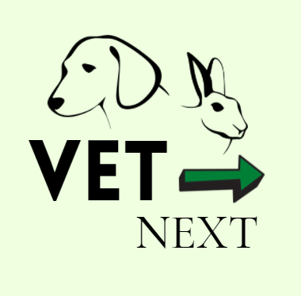                        


                OBJETIVO DO PROJETO VetNext:

    
     Devido a necessidade e dificuldade que tive de achar informações de Hopitais Veterinário pensei nesse projeto VetNext, 
     que tem por objetivo auxiliar de uma forma fácil e rápido a busca de hospitais \Veterinário/ \Emergência e urgência./,  
     e também hospitais para animais exóticos, que algumas pessoas  tem como animais de estimação, neles poderão encontrar
     informações necessárias.

     Nosso projeto é um CRUD completo integrado no banco de dados, onde será possivel listar todos hospitais cadastrados.

                COMO SERÁ APLICADO?  
     
     Os donos dos Pets ou animais exóticos poderão acessar a lista dos hospitais de forma livres, 
     ou se optarem podem buscar por bairro, cidade,categoria ou se dono de animais exoticos por ex: 
     pode buscar po roedores, verá o hospital que trata dessa especialidade.
  
    
    
     

 ### TECNOLOGIA E DEPENDÊNCIAS USADAS PARA CONSTRUCÃO DA API:
 
* **Visual Studio Code;**
* **Git e Github**;
* **Postman**;
* **Nodemon**;
* **MongoDB**;
* **Mongoose**;
   * **bcrypt**: ^5.0.1
    * **cors**: ^2.8.5
    * **dotenv**: ^10.0.0
   * **dotenv-safe**: ^8.2.0
   * **express**: ^4.17.1"
    * ***jsonwebtoken**: ^8.5.1
    * ***mongoose**: ^5.13.5
    * **nodemon**: ^2.0.12
    * **Heroku**;
    
                
##Estrutura
```
├── src
│   ├── controllers
|   |  ├── administradorController.js
|   |  ├── vetNextController.js
|   |  ├── vetNextExoticController.js
    |__data
        | __database|
│   ├── models
|   |  ├── administrador.js
|   |  ├── VetNext.js
       |__ vetNextExotic.js
│   ├── routes 
│   |  ├── administradorRoutes.js
|   |  ├── vetNextExoticRoutes.js
|   |  ├── vetNextRoutes.js 
|   ├── .env
├── .env.example
|__ package-lock.json
├── package.json
├── server.js
```

###USAMOS SEGUINTES ROTAS PARA MANIPULAÇÃO VETNEXT:


 |Método HTTP  |      EndPoint        |    Descrição                    |
 |-------------|----------------------|---------------------------------|
 |             |                      |                                 |
 | POST        |        `/`           |    Criar novo VetNext           |
 | GET         |         `/`          |    Retorna todos VetNext        |
 | GET         |        `/:Id`        |    Lista VetNext por ID         |
 | GET         |       `/categoria`   |    LIsta VetNext por Categoria  |
 | GET         |        `/bairro`     |    Lista VetNext por Bairro     |
 | GET         |        `/cidade`     |    Lista VetNext por Cidade     |
 | PUT         |        `/:Id`        |    Atualiza info de um VetNext  |
 | DELETE      |        `/:Id`        |    Remove VetNext específico    |


###USAMOS SEGUINTES ROTAS PARA MANIPULAÇÃO VETNEXTEXOTIC:


|  Método HTTP    |   EndPoint          |    Descrição                           |
|-----------------|---------------------|----------------------------------------|               
|                 |                     |                                        |
|  POST           |     `/`             |  Criar novo VetNextExotic              |
|  GET            |     `/`             |  Retorna todos VetNextExotic           |
|  GET            |     `/:Id`          |  Busca VetNextExotic por ID            |
|  GET            |     `/especialidade`|  Retorna VetnextExotic espec escolhida |
                 


  ###USAMOS SEGUINTES ROTAS PARA MANIPULAÇÃO ADMINISTRADOR:

|                 |                        |                                 |
|-----------------|------------------------|---------------------------------|
|POST             |     `/create`          |cria o administrador             |
|POST             |     `/create`          |criar login do administrador     |


### ALGUMAS ROTAS DO CRUD USADA NO POSTMAN [VETNEXT]:

ROTA PARA LISTAR VETNEXT
[GET] https://projeto-reprograma-vetnext.herokuapp.com/vetNext/

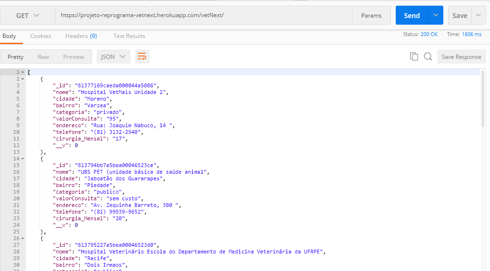

ROTA PARA BUSCAR POR BAIRRO
[GET] https://projeto-reprograma-vetnext.herokuapp.com/vetnext/bairro?bairro=Várzea

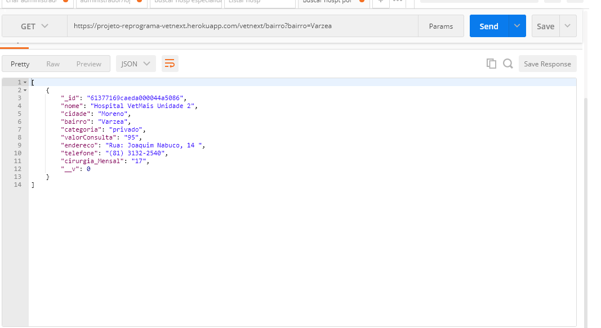

ROTA PARA PARA BUSCAR POR CATEGORIA 
[GET] https://projeto-reprograma-vetnext.herokuapp.com/vetnext/categoria?categoria=publico

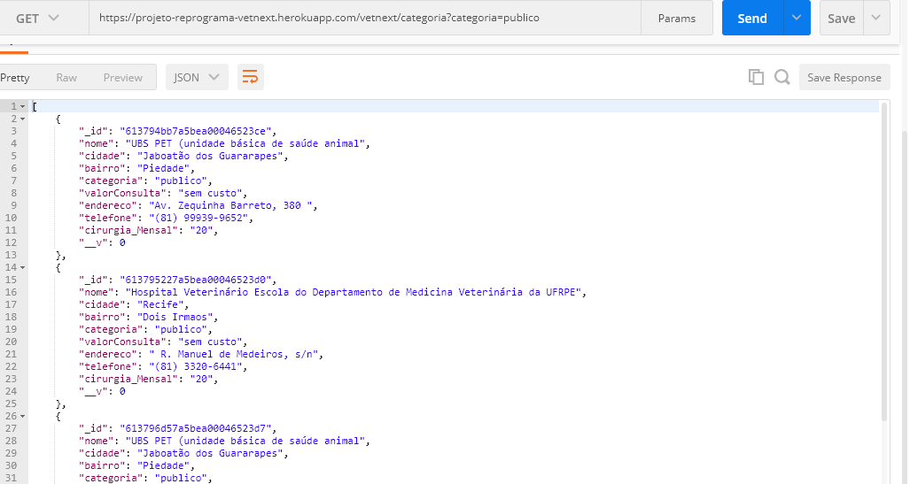

ATUALIZAR VETNEXT  
[GET] https://projeto-reprograma-vetnext.herokuapp.com/vetNext/61379a8b7a5bea00046523e1

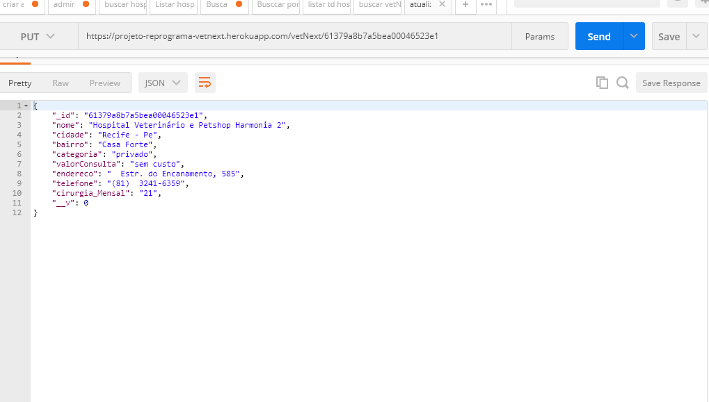


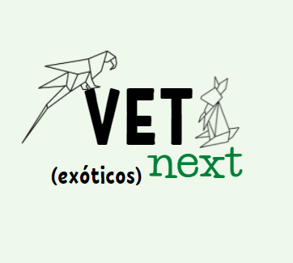


### ALGUMAS ROTAS DO CRUD USADA NO POSTMAN [VETNEXTEXOTIC]:


ROTA PARA LISTAR VETNEXTEXOTIC
[GET] https://projeto-reprograma-vetnext.herokuapp.com/vetnextexotic

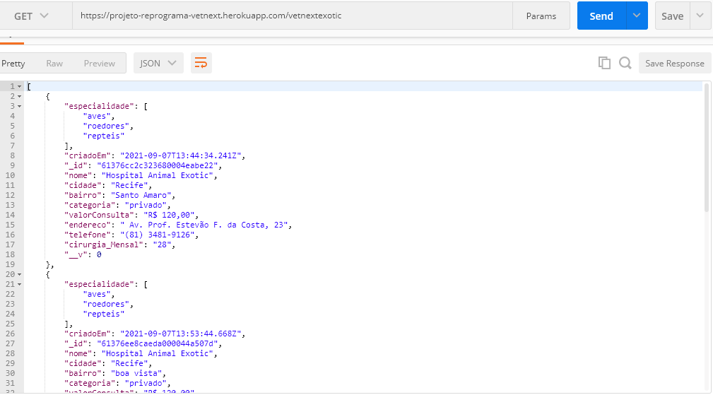


ROTA PARA PARA BUSCAR POR ESPECIALIDADE [REPTEIS]
[GET] https://projeto-reprograma-vetnext.herokuapp.com/vetnextExotic/?especialidade=repteis

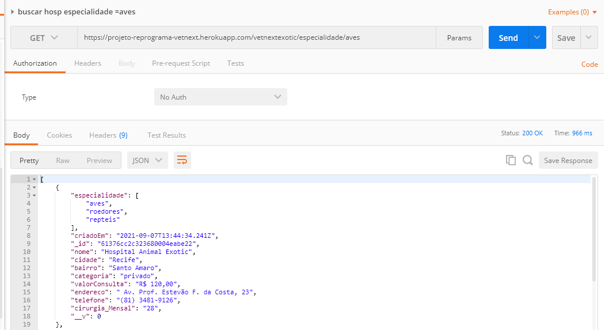


### ROTA PARA CRIAR ADMINISTRADOR:

[POST] https://projeto-reprograma-vetnext.herokuapp.com/administrador/create [SENHA]

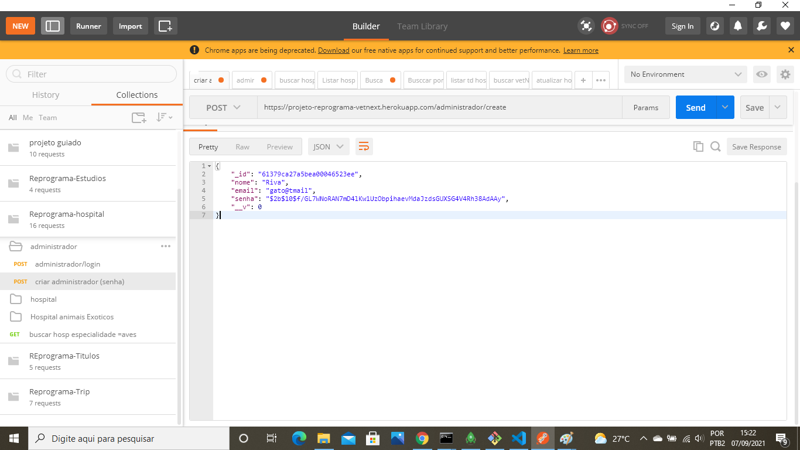

 ROTA PARA CRIAR [LOGIN] DO ADM
[POST] https://projeto-reprograma-vetnext.herokuapp.com/administrador/login

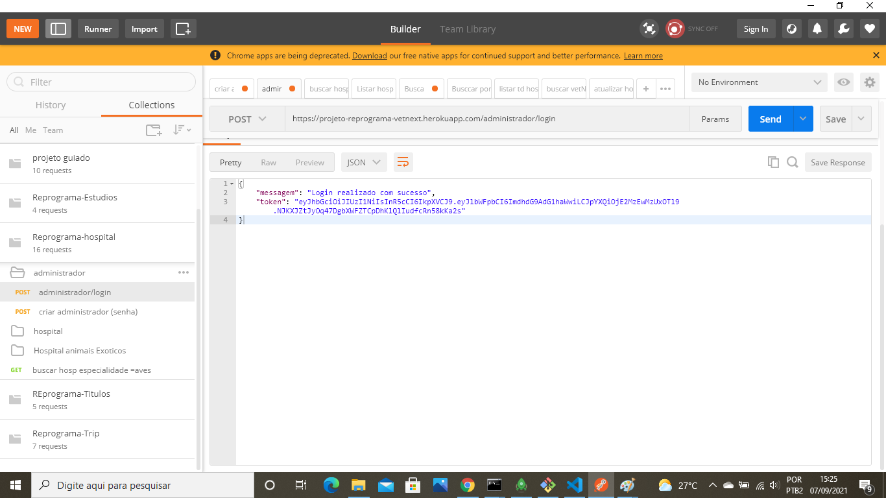

## Regras de Negócios:

Só com autorização o tutor podera cadastrar algum Hospital.


### FUTURAS MELHORIAS:

Criar um aplicativo VETNEXT , onde o tutor poderá se cadastrar,e se houver uma emergência, acionar
a ambulância mais próxima de seu local por ele.


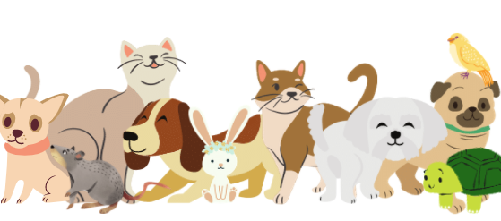


## AGRADECIMENTOS
```
- Deus,
- Familia,
- Reprograma,
- Accenture,
- Professoras,
- Monitoras,
- Facilitadora,
- Colegas,
```

### HOMENAGEM


```
 Nesta manhã vamos lhe falar ,sobre um projeto do REPROGRAMA que veio para ficar ,
foram muitas meninas para uma vaga conquistar.
Sexta-feira à noite Vamos nos preparar, porque sábado pela manhã a FACILITADORA CAROL
vai falar.
vai começar a chamada, vamos atenta ficar. para não levar uma falta e nos prejudicar.
Não vamos deixar as PROFESSORAS de lado, foram elas que ensinaram nossos primeiros 
passos,
do Git ao Mongo foi uma grande trajetória, e no meio do caminho já  vemos Vitória.
Cada um do seu jeitinho contando a sua história, elas agora fazem parte da nossa trajetória,
apresentando os códigos de uma melhor forma.
não vou citar nomes porque  seria injusto, mas quero parabenizar em nome do grupo. 
Foram muitas MONITORAS que por aqui passou, Cada um com seu jeitinho um abraço deixou,
na hora do aperto um help vou gritar. 
Elas, estarão prontas para nos ajudar,
era muito código para gente assimilar, muitas informações isso não vou negar.
deu vontade de desistir, mas estamos aqui, pra Vitórias contar.
Cada um Com seus Problemas, com seu dilema enfrentar,
mas teve alguém muito importante pra etapa nos ajudar.
Foi a nossa PSICÓLOGA que que veio para somar nos dando palavra de força e nos ajudando 
a cabeça levantar
Agora o que falar dessa turma tão linda , On12 agora  faz parte da nossa vida,
Cada uma com seu jeitinho as duplas foram formando, Segurando uma na mão da outra mesmo 
dentro do ônibus.
O sábado não será mais o mesmo, isso n vou negar ,ainda bem que tem os vídeos pra saudade matar.
E o whatsapp pra mensagem mandar,
Mesmo que seja virtual, um abraço vamos dar, 
com a conquista de cada uma vamos nos alegrar
Esse nome é complicado me enrola a língua para falar bootcamp da ACCENTURE queremos aplauso dar.
Agora para finalizar a mentoria vou agradecer , por um papo legal que veio nos trazer ,
Obrigado REPROGRAMA toda equipe foi um prazer ,estamos aqui agradecendo, um abraço MEU e da 
ON 12 POSSAM RECEBER.
```


  
